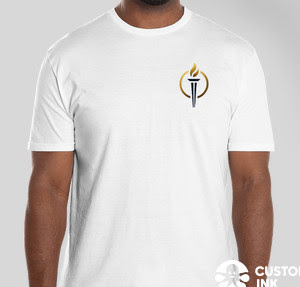
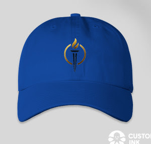
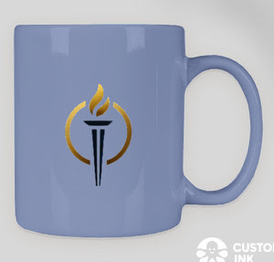

WIP
{: .label .label-yellow}
<html lang="en">
<head>
    <meta charset="UTF-8">
    <meta name="viewport" content="width=device-width, initial-scale=1.0">
    <title>Political Campaign</title>
    
</head>
    

        

             <!-- Replace with your image path -->
        

        

            <h1>Your Voice Matters</h1>
            
Prepare to vote for Miles this election!

            

                <input type="email" class="input-field" placeholder="Enter your email" required>
                <button class="submit-button">Sign Up for Newsletter</button>
            

        

    

    

        

        

        <h2>Check Out Our Merchandise</h2>
        

              <!-- Replace with actual image paths -->
            
            
        

        <a href="/merch">Visit Our Merch Page</a>
        

      

        <h2>Donate Now</h2>
        <a href="/Funding/Donations.md">Go to Donations Page</a>
        

</html>

